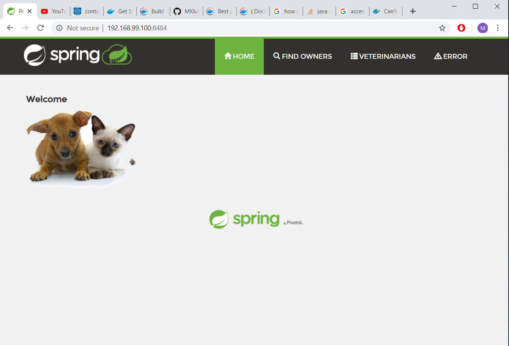

[Docker File Contents](Dockerfile)

- Click to expose the Docker File Contents

[Docker ps command Contents](images/DockerPS.PNG)

- Docker Process list showing the running Docker image.

- Browser hitting the main page of the application of the running Docker Container
- We are running Docker Toolbox here and need to hit the Private IP of the Docker Server to see the application
